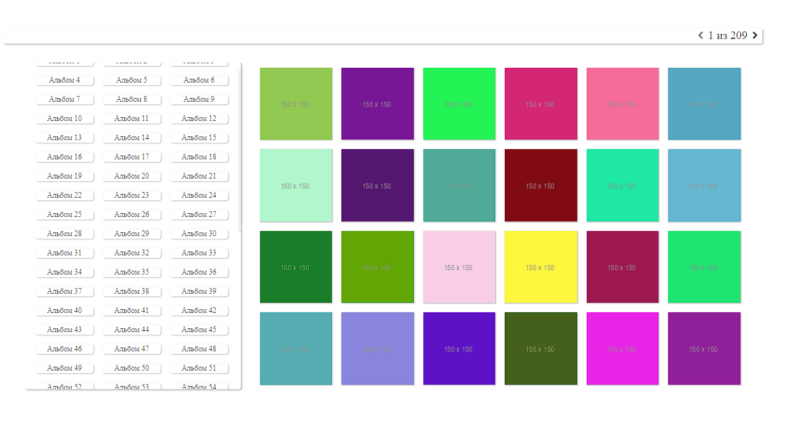
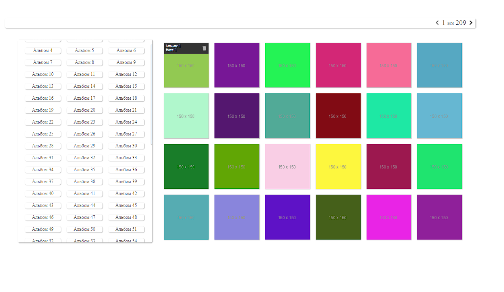

#### Общее фото.

#### При наведении на фото.

#### Фильтр по альбомам. Счетчик страниц в верхнем правом углу меняется.

#### Модалка по центу. Для закрытия клик вне модалки.

#### При наведении на модалку title модалки.

## Пункты задания были таковы:
1. Создать приложение, где нужно вывести через Rest API данные (можно плиткам) (Ссылка на данные - http://jsonplaceholder.typicode.com/photos;
2. Сделать постраничный вывод картинок;
3. Сделать кнопку удаления картинки;
4. При нажатии выводить модалку с увеличенной картинок (для списка - thumbnailUrl, для модалки - url);
5. Сделать возможность сортировки по айдишнику альбома (albumId), сделать может быть селектор или же просто вывести над списком все айдишники и при нажатии делать фильтрацию.

## Для выполнения тестового я использовала следующие технологии:
- Create React App;
- Redux;
- Redux Toolkit;
- Sass;
 
> Чтобы запустить проект в режиме разработки выполните команду `npm start`, предварительно не забудьте сделать `npm instal`.

